[TOC]

实验说明
========

PB16060562 毕瑜

##课程建议

- 建议开课时长长一些
- 建议组队完成项目，还可以将项目提交到github上，同学们还可以学习到git的使用，组队完成项目会使各自负担更小。
- 非常想将项目放到真正的网页上运行，据说学校给每个学生的邮箱名也分配了ftp空间，本来很想直接把网站放到上面让老师在线检查，但还没学会如何远程连接数据库。希望以后的课程里，学生可以把作业放到各自的ftp空间在线访问。
如果有更长的时间，以后会把项目放到home.ustc.edu.cn/~biu中（我的ftp空间）

1.在eclipse中测试前要修改的配置
----------------------------
本项目实现站内下载和上传及登录注册的功能

- 数据库导入
    项目中有两个sql文件，请建立一个数据库名为users再两次导入这两个文件。
    关于本地数据库的用户名等设置，仍然在老师的模板的bean.xml中（工程是在老师的模板的基础上一步步改的）。

        <property name="driverClassName" value="com.mysql.jdbc.Driver"/>
        <property name="url" value="jdbc:mysql://localhost:3306/users?useSSL=false"/>
        
        <property name="username" value="root"/>
        <property name="password" value="biubiubiu"/>

- jdk 环境
    + *jre-9.0.4 可能需要更改*
    
- Tomcat 版本
    + *Apache Tomcat v8.5. 可能需要更改*
    + 新建Tomcat映射时，*可能需修改Server Location到Tomcat安装目录*，以确保上传的文件保存在Tomcat目录的webapps\upload\doc下，如图
    
以防万一，java程序中将保存上传文件的目录打印在Console中以查看。

2.程序实现的功能
----------------------------
- ####开始测试
    
    设置了过滤器，在浏览器中输入
    http://localhost:8080/spring5
    首先出现的是登录页面signin.jsp(usignin.action)
    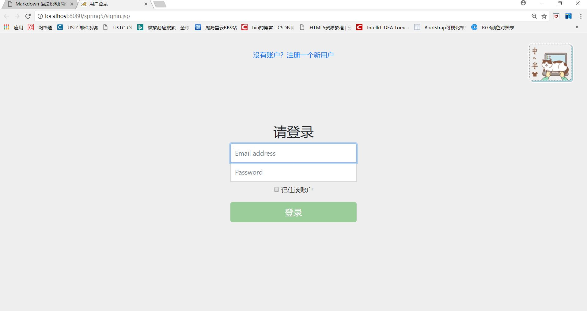

>有时候css文件夹中的样式表在第一次加载时有一定概率没有加载，之后刷新又可能会陆续加载出来，可查看运行截图或者重启一次Tomcat。

可直接登录
Email address:test@ustc
password:123
用户名为host不用输入。
也可以注册一个新的用户如图，点击“没有账户？注册一个新的用户”
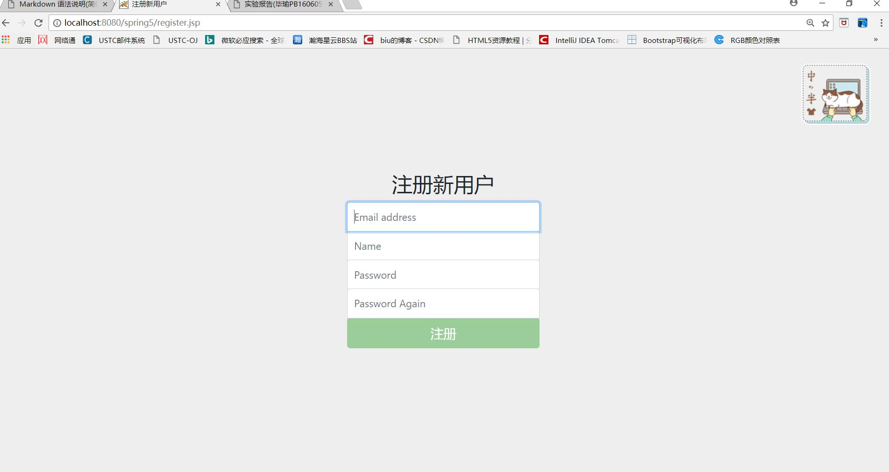
session中设置30分钟后登录失效。
注册或登录成功后跳转到主页index.jsp(重定向flist.action在首页加载了上传文件列表)
>如果不登录就进入index.jsp则主页不会加载上传文件列表

- ####首页介绍

1.首页如图，“用户名”链接点击后，会进入个人主页。“文档”、“视频”、“图片的链接点击后进入各个页面
搜索功能暂时还没有实现

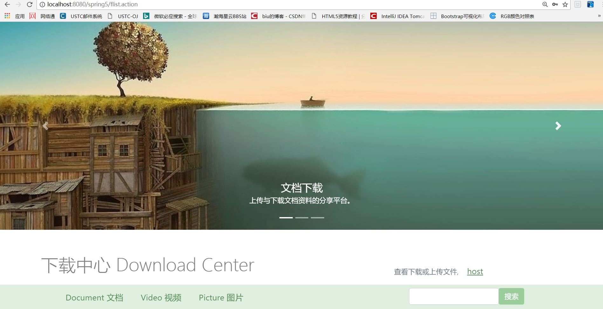
点击图片中央的文档下载可进入文档下载的页面

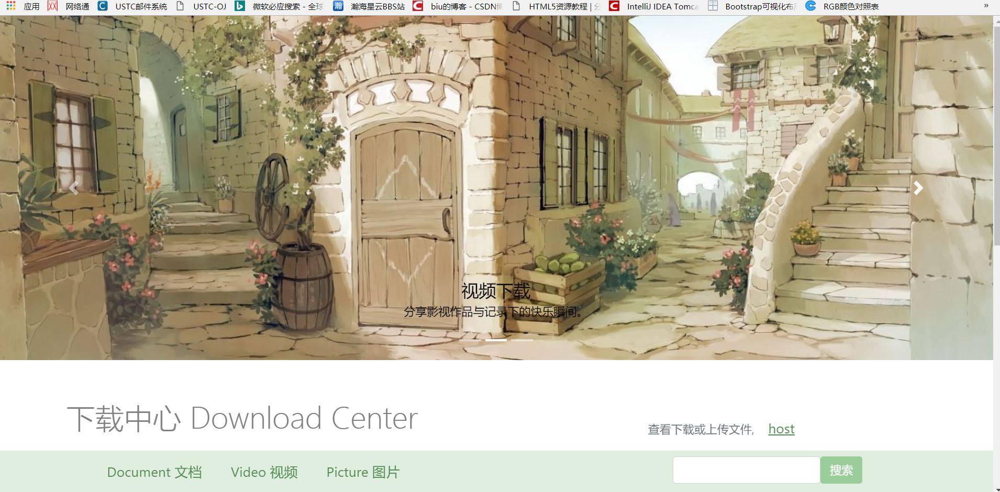
点击图片中央的图片下载可进入图片下载的页面

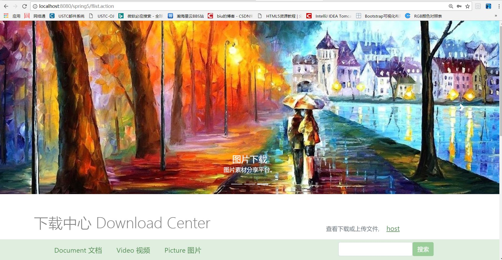
点击图片中央的视频下载可进入视频下载的页面

2.下方左侧栏为上传文件列表，格式为“文件简介：文件名”，直接点击就可下载。
右侧有三项关于“文件显示”、“文件上传”、“文件下载”的简要的使用说明，右侧卡片中有相应的下载链接
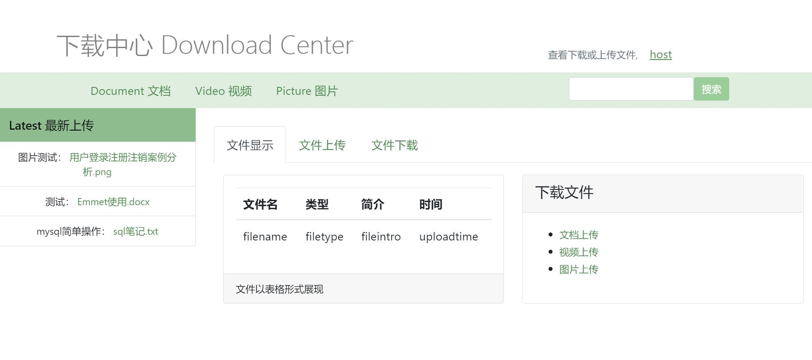
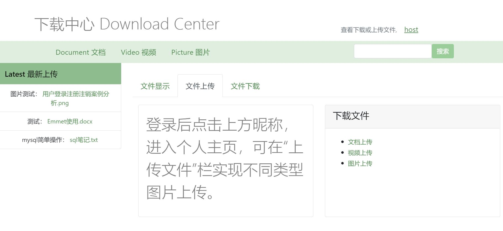
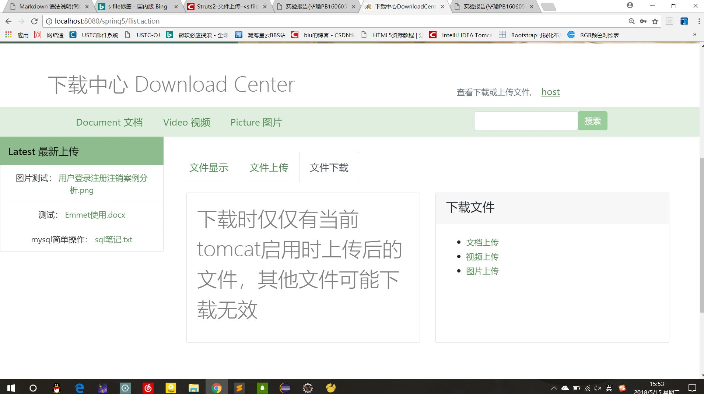

- ####上传文件

点击用户名的链接进入个人主页，如图
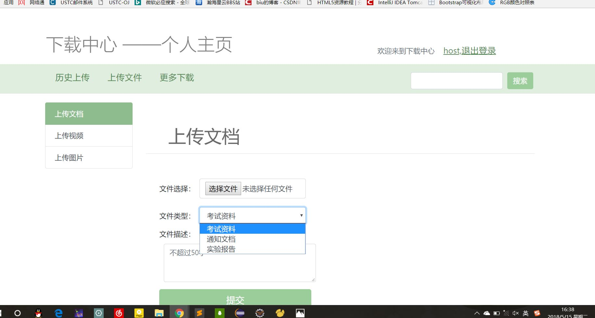

右侧可选上传文档，上传图片，上传视频
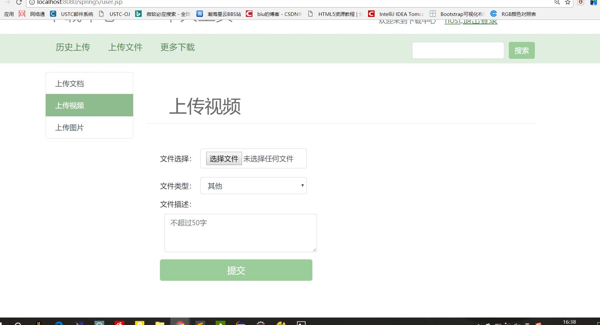
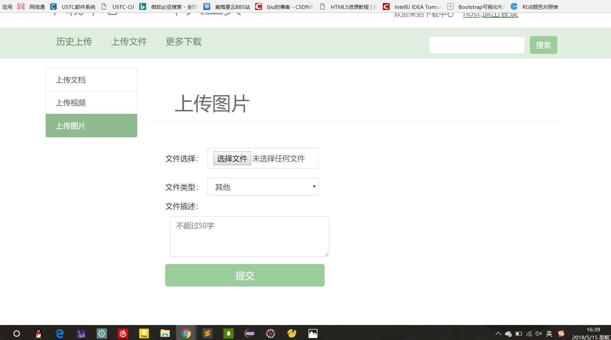

分别有不同的文件拦截器，有不同的文件类型和文件大小限制（struts.xml中配置的文件大小限制在100M）
(输出错误信息配置方式在src/mess.properties中）
>如果遇到不支持的类型，可在相应的struts.xml文件中的中添加报错显示的类型。

    <param name="allowedTypes">image/ief,image/jpeg,image/png</param>

报错示例：(最终提交版本可上传该类型)

如果上传成功则跳转到导航栏的“历史上传”界面，如图
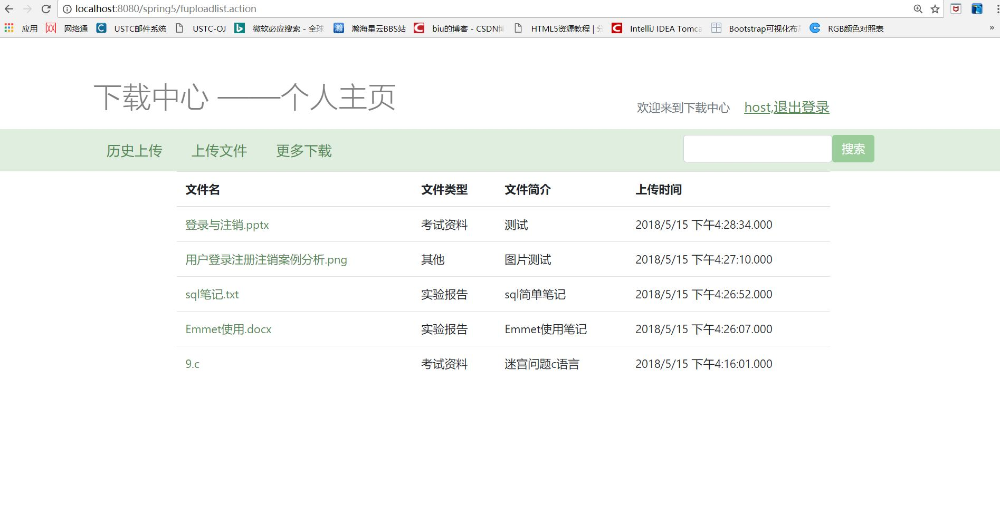
该界面中直接点击文件名也可下载。

此时可通过点击“上传文件”回到之前的页面。
点击“更多下载”回到主页(index.jsp/flist.action)。
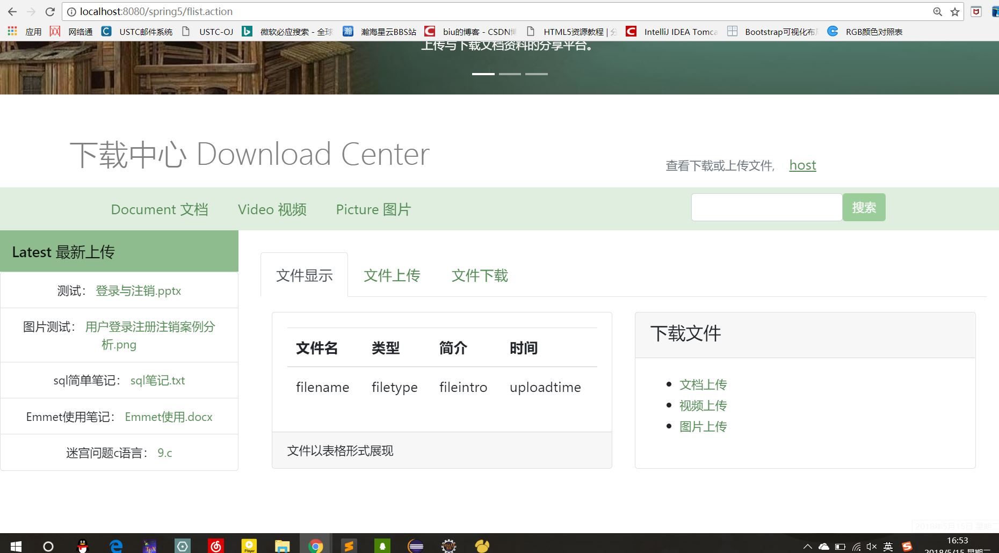

>上传的文件仅保存在Tomcat目录的webapps\upload的各目录下，Tomcat终止以后，上传过的文件可能会丢失（在FileUploadAction.java和FileUtil.java中有io的读写文件操作，上交前测试代码文件时不会随Tomcat终止丢失的，但文件仍有可能丢失）

- ####下载文件
 
1. 测试下载

    测试下载主页中的“最新上传”栏中的9.c文件，弹出浏览器下载框
    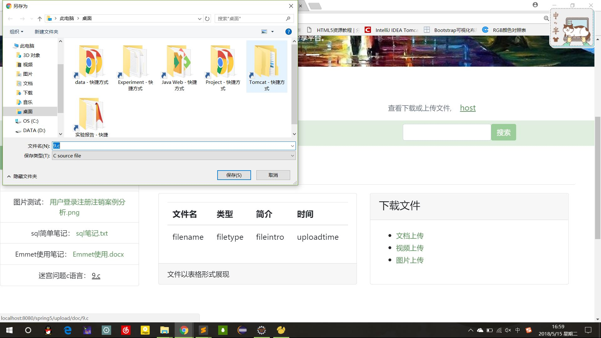
    也可在浏览器中直接输入
    http://localhost:8080/spring5/upload/doc/9.c
    可看到文件中的内容，如图
    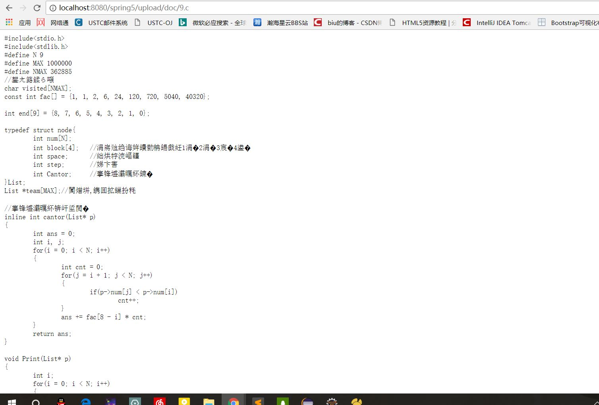

2. 下载分类

    从首页可进入的“文档”、“图片”、“视频”中点击，可进入
    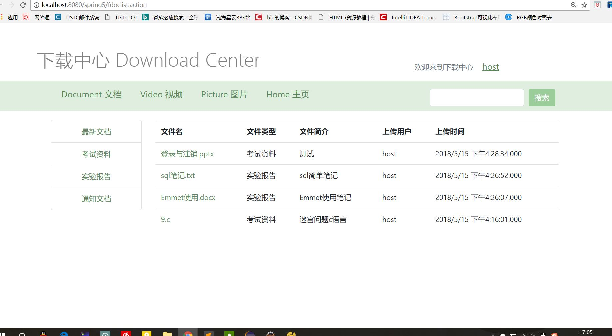
    文档主界面中有四种分类，各个列表都以上传时间降序排列
    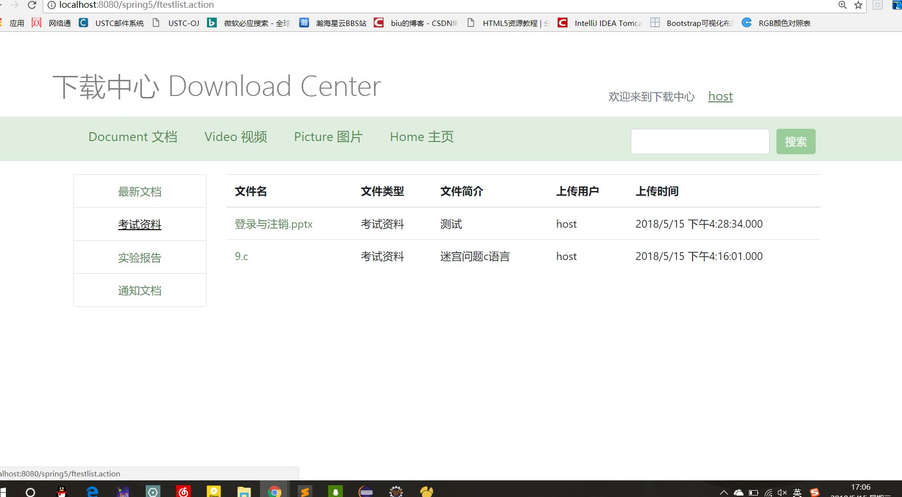
    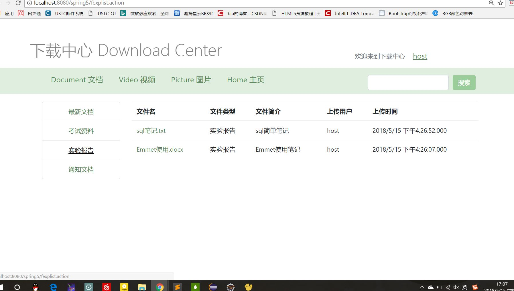

    #####其他页面：
    
    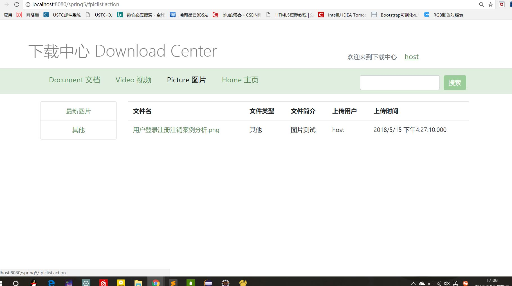
    

2.项目结构说明
-------------
####数据库文件

- files.sql保存上传的文件信息
- user.sql保存登录信息

####jar包

- jdk 环境
    + jre-9.0.4

- Tomcat 版本
    + Apache Tomcat v8.5. 用到了Tomcat中lib文件下的jar包

- 老师给出的模板中原有的jar包

####老师的文件的修改

- struts.xml中新建了多个file操作对应的action，其中用到了action重定向，interceptor文件拦截器

- UserAction中新增了signin,signout,index等方法

####新增文件
以下文件模拟了老师的UserAction相关的文件

- File.java
- UploadInfo.java
- FileManager.java
- FileMapper.java
- FileMapper.xml
- FileManagerImpl.java
- FileUploadAction
……

- LoginFilter.java用于登录验证文件过滤

- FileUtil.java用于保存上传的文件

- mess.properties用于设置文件上传时的错误信息样式

####前端文件
由bootstrap4前端框架编写

3.实验总结
-------------

####以下实验心得可忽略

1.写了一个过滤器LoginFilter, 在ustc.javaweb.service中
但在跳转页面后发现s标签中的Action内容没有正常显示
因为直接跳转的话少了一句

    this.user = this.userManager.loadByEmail(user.getEmail()); 
解决方法：跳转的时候不直接跳转到.jsp页面而是跳转uload.action

新问题：
执行这句话时，会报错空指针，因为user此时为null，
最终解决方案：必须要将登录信息暂存到session中，action每次使用都会新建新的实例。因此在action的signin()函数中添加新的代码

    session.setAttribute("email", user.getEmail()); 
    ession.setAttribute("name", user.getName());
jsp中的s标签修改为

    <s:property value="#session.name" default="请登录"/>
最终实现登录前只跳转到登录页面，登录后显示登录用户的name。

2.注销功能
应该新写一个LogOut的action，考虑到这个action里只有session的操作，不如放到UserAction里作为一个signout函数调用。

3.不知道怎么显示数据库的表中的内容，搜索也各有千秋。看到老师已经写好的List<User>一下子感觉少走了很多弯路。

4.保存文件时总是保存到了 .metadata\.plugins\org.eclipse.wst.server.core\tmp0\wtpwebapps目录下
需要修改Tomcat的Server Location
删掉现在的Tomcat克隆，再eclipse新建tomcat克隆并且不添加任何工程进去，再在tomcat上点击右键open，Server Location不再是灰色的了。
把它修改到如图位置

    F:\Tomcat\apache-tomcat-8.5.24\webapps\springMybatisStruts2\upload\doc

5.有时候css样式表总是不加载，后来发现在浏览器第一次登录的时候再也不加载了，在网上百度多次一直没有任何靠谱的答案
*后来发现原来是写文件过滤器的时候，只写了jsp文件，而css文件被过滤了无法加载。*

