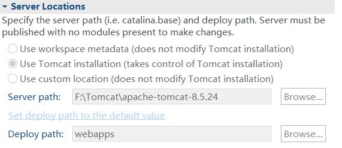
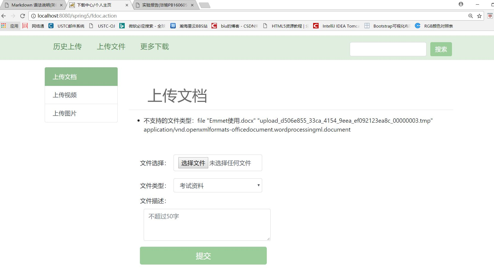
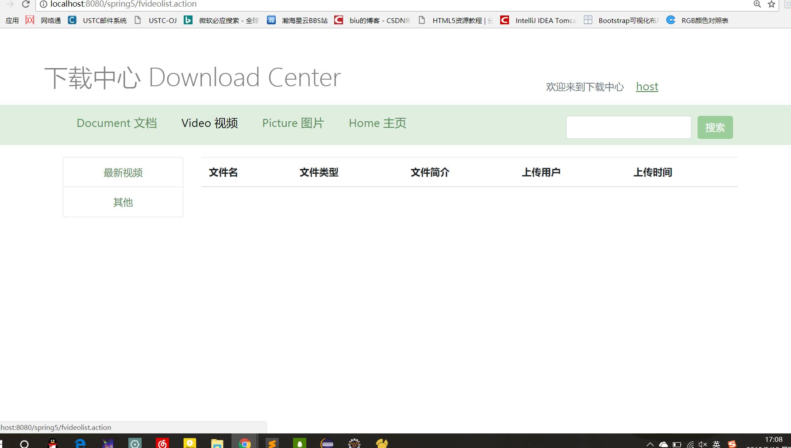

Javaweb-Project
========

biu@mail.ustc.edu.cn

1.在eclipse中测试前要修改的配置
----------------------------
本项目实现站内下载和上传及登录注册的功能

- 数据库导入
    项目中有两个sql文件，请建立一个数据库名为users再两次导入这两个文件。
    关于本地数据库的用户名等设置，仍然在老师的模板的bean.xml中（工程是在老师的模板的基础上一步步改的）。

        <property name="driverClassName" value="com.mysql.jdbc.Driver"/>
        <property name="url" value="jdbc:mysql://localhost:3306/users?useSSL=false"/>
        
        <property name="username" value="root"/>
        <property name="password" value="biubiubiu"/>

- jdk 环境
    + *jre-9.0.4 可能需要更改*
    
- Tomcat 版本
    + *Apache Tomcat v8.5. 可能需要更改*
    + 新建Tomcat映射时，*可能需修改Server Location到Tomcat安装目录*，以确保上传的文件保存在Tomcat目录的webapps\upload\doc下，如图
    
以防万一，java程序中将保存上传文件的目录打印在Console中以查看。

2.程序实现的功能
----------------------------
- #### 开始测试
    
    设置了过滤器，在浏览器中输入
    http://localhost:8080/spring5
    首先出现的是登录页面signin.jsp(usignin.action)
    

>有时候css文件夹中的样式表在第一次加载时有一定概率没有加载，之后刷新又可能会陆续加载出来，可查看运行截图或者重启一次Tomcat。

可直接登录
Email address:test@ustc
password:123
用户名为host不用输入。
也可以注册一个新的用户如图，点击“没有账户？注册一个新的用户”

session中设置30分钟后登录失效。
注册或登录成功后跳转到主页index.jsp(重定向flist.action在首页加载了上传文件列表)
>如果不登录就进入index.jsp则主页不会加载上传文件列表

- #### 首页介绍

1.首页如图，“用户名”链接点击后，会进入个人主页。“文档”、“视频”、“图片的链接点击后进入各个页面
搜索功能暂时还没有实现

点击图片中央的文档下载可进入文档下载的页面

点击图片中央的图片下载可进入图片下载的页面

点击图片中央的视频下载可进入视频下载的页面

2.下方左侧栏为上传文件列表，格式为“文件简介：文件名”，直接点击就可下载。
右侧有三项关于“文件显示”、“文件上传”、“文件下载”的简要的使用说明，右侧卡片中有相应的下载链接

- #### 上传文件

点击用户名的链接进入个人主页，如图

右侧可选上传文档，上传图片，上传视频

分别有不同的文件拦截器，有不同的文件类型和文件大小限制（struts.xml中配置的文件大小限制在100M）
(输出错误信息配置方式在src/mess.properties中）
>如果遇到不支持的类型，可在相应的struts.xml文件中的中添加报错显示的类型。

    <param name="allowedTypes">image/ief,image/jpeg,image/png</param>

报错示例：(最终提交版本可上传该类型)

如果上传成功则跳转到导航栏的“历史上传”界面，如图

该界面中直接点击文件名也可下载。

此时可通过点击“上传文件”回到之前的页面。
点击“更多下载”回到主页(index.jsp/flist.action)。

>上传的文件仅保存在Tomcat目录的webapps\upload的各目录下，Tomcat终止以后，上传过的文件可能会丢失（在FileUploadAction.java和FileUtil.java中有io的读写文件操作，上交前测试代码文件时不会随Tomcat终止丢失的，但文件仍有可能丢失）

- #### 下载文件
 
1. 测试下载

    测试下载主页中的“最新上传”栏中的9.c文件，弹出浏览器下载框
    
    也可在浏览器中直接输入
    http://localhost:8080/spring5/upload/doc/9.c
    可看到文件中的内容，如图
    

2. 下载分类

    从首页可进入的“文档”、“图片”、“视频”中点击，可进入
    
    文档主界面中有四种分类，各个列表都以上传时间降序排列
    
    

    ##### 其他页面：
    
    
    

2.项目结构说明
-------------
#### 数据库文件

- files.sql保存上传的文件信息
- user.sql保存登录信息

#### jar包

- jdk 环境
    + jre-9.0.4

- Tomcat 版本
    + Apache Tomcat v8.5. 用到了Tomcat中lib文件下的jar包

#### 部分文件说明

- struts.xml中用到了action重定向，interceptor文件拦截器

- LoginFilter.java用于登录验证文件过滤

- FileUtil.java用于保存上传的文件

- mess.properties用于设置文件上传时的错误信息样式

#### 前端文件
由bootstrap4前端框架编写

